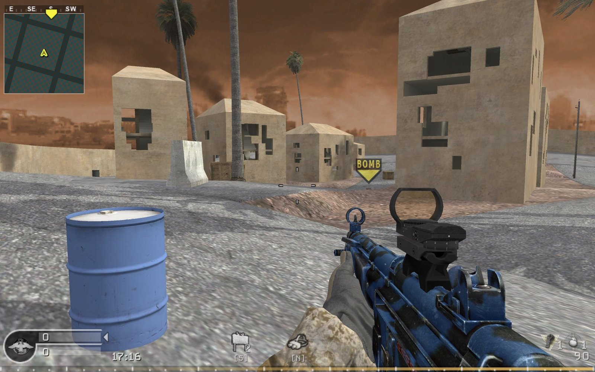
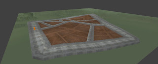
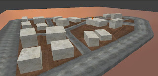
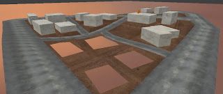
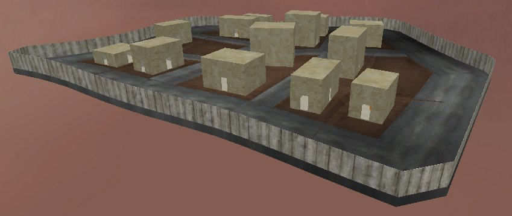
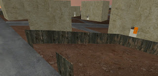
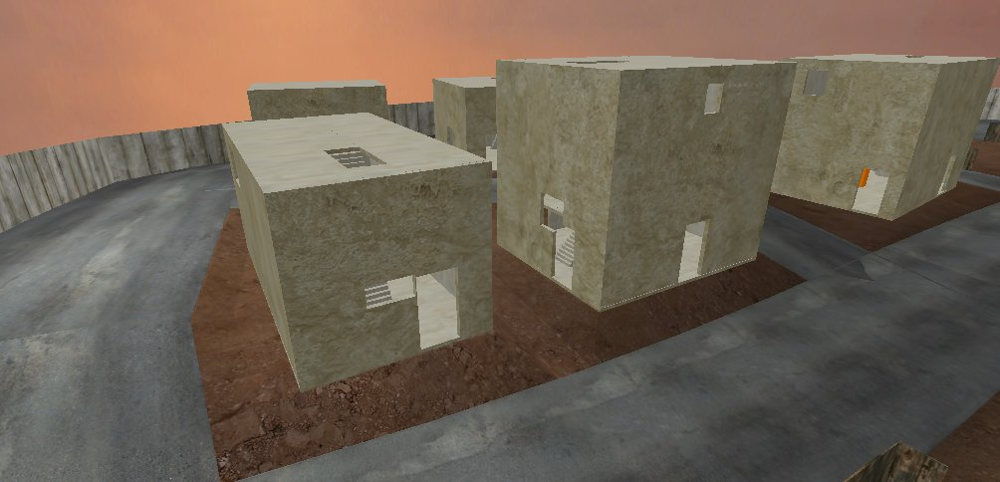

# prag
CoD4 Map generation in JS

Gameplay screenshot

Skybox, main roads, and dirt roads, all procedurally generated.

Placeholder blocks where buildings could go.

Four blocks deleted to show holes in terrain where the buildings sit.

Doorways added to buildings and an outer fence to prevent players from falling into the void.

A small building-less area surrounded by partial fence.

Windows added to buildings in random (not always sensible) locations. Stairways too.
